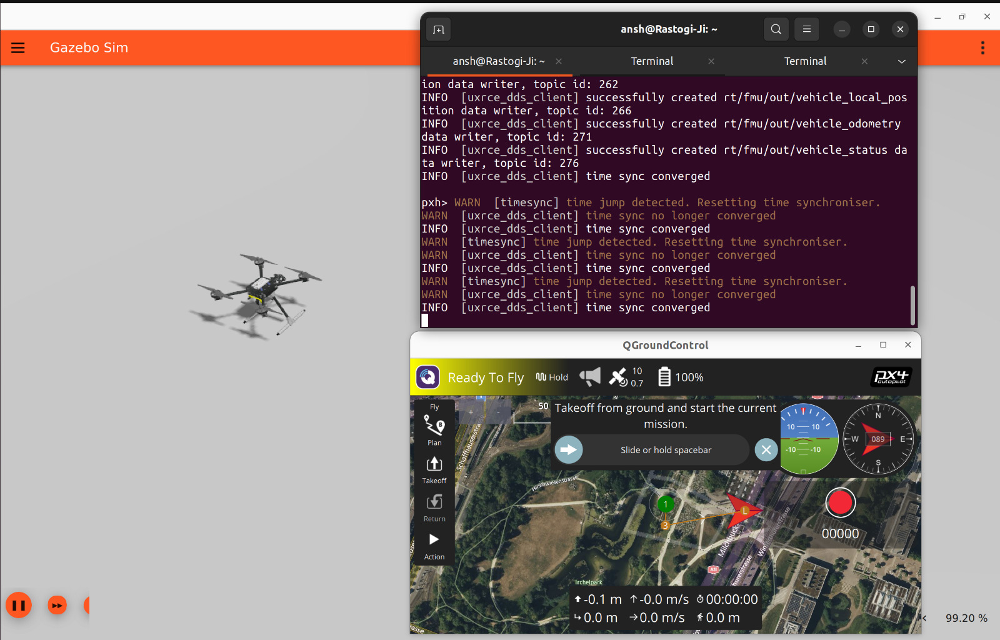
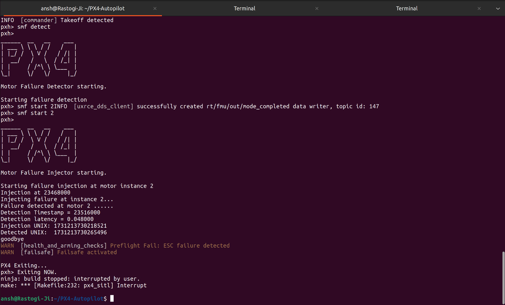

# Inter-IIT IdeaForge Doc
This is the main document for implementing the solutions for Inter-IIT IdeaForge PS.   
This document includes:
- setting up the simulation environment on your local system
- implementing motor failure through custom PX4 based module
- generating the results for real time behaviour of drone on motor failure
- running the motor failure & motor detection modules based on PX4 architecture    
The detection module will automatically trigger the landing or hovering modules.

## Pre-requisites :
- You system should have ubuntu-22.04 LTS Desktop installed (either dual booted with windows or completely ubuntu 22).
- In case you don't have ubuntu-22.04 dual boot, you can follow this tutorial [dual boot ubuntu-22.04](https://www.youtube.com/watch?v=QKn5U2esuRk).


## PX4 Environment setup with ROS2 & Gazebo

### 1. First update the debian packages on your system :  
- Run these commands in your terminal
```
sudo apt update
sudo apt upgrade -y
```

### 2. Install ROS2-humble :
- Follow this tutorial -> [install ros2-humble](https://docs.ros.org/en/humble/Installation/Ubuntu-Install-Debs.html).

- Run this command to permanantly source your ros2 environment
```
echo "source /opt/ros/humble/setup.bash" >> ~/.bashrc
```

### 3. Install PX4 firmware :
```
cd ~
git clone https://github.com/PX4/PX4-Autopilot.git --recursive
bash ./PX4-Autopilot/Tools/setup/ubuntu.sh
sudo reboot
```
- Please make sure that there is no error while cloning the PX4-Autopilot repository as otherwise it will cause issues in further steps.

### 4. Install ROS2 dependencies :
```
pip install --user -U empy==3.3.4 pyros-genmsg setuptools
sudo apt install python3-colcon-common-extensions
sudo apt install ros-humble-desktop python3-argcomplete
sudo apt install ros-dev-tools
```

### 5. Install XRCE-DDS Agent :
```
cd ~
git clone https://github.com/eProsima/Micro-XRCE-DDS-Agent.git
cd Micro-XRCE-DDS-Agent
mkdir build
cd build
cmake ..
make
sudo make install
sudo ldconfig /usr/local/lib/
```

### 6. Installing QGroundControl (GCS) :
```
sudo usermod -a -G dialout $USER
sudo apt-get remove modemmanager -y
sudo apt install gstreamer1.0-plugins-bad gstreamer1.0-libav gstreamer1.0-gl -y
sudo apt install libfuse2 -y
sudo apt install libxcb-xinerama0 libxkbcommon-x11-0 libxcb-cursor-dev -y
cd ~
```
- Now download the app-image file from [here](https://d176tv9ibo4jno.cloudfront.net/latest/QGroundControl.AppImage) in your `/home/username/` directory.   
- Change the executable permissions for GCS & try to run it
```
cd ~
chmod +x ./QGroundControl.AppImage
./QGroundControl.AppImage
```
Close the terminal (by interrupting with `ctrl + c`) to close the QGroundControl.


### 7. Testing the PX4 setup :

- Build & launch the gazebo simulation with SITL
```
cd ~/PX4-Autopilot
make px4_sitl gz_x500
```   

- Run the XRCE-DDS Agent   
```
cd ~/Micro-XRCE-DDS-Agent/build
MicroXRCEAgent udp4 -p 8888
```
- Launch QGroundControl (GCS)
```
cd ~ && ./QGroundControl.AppImage
```

- In the SITL terminal (the one from where you launched gazebo), run the following command to arm & takeoff the drone
```
commander takeoff
```
If everything works fine, you should get something like this
<div align="center">
  
</div> 

- Use the command `commander land` to land the drone.


## Building custom px4 module
- For simulating single motor failure, we have created a custom module based on PX4 firmware architecture named [`single_motor_failure`](px4_modules/single_motor_failure/).
- In this module we've integrated injection of single motor failure, detection of motor failure and controlling the drone after detection of motor failure.
- We have used the predefined px4 based UORB topics to send commands to the drone in the modules.
- You can follow [creating custom px4 module](px4_modules/modules_README.md) doc to know more about how to create a custom px4 module and compile it. 

### 1. Building the module in PX4-firmware:
In order to run the `single_motor_failure` module you first need to make sure that it is built as part of PX4 Firmware.    
Applications are added to the build/firmware in the appropriate board-level px4board file for your target:

PX4-SITL (Simulator) : px4_sitl_default

- To use this module, copy the `single_motor_failure` directory to `~/PX4-Autopilot/src/examples/` directory.

- To enable the compilation of the application/module into the firmware add the corresponding Kconfig key CONFIG_EXAMPLES_TEST_MODULE=y in the `px4board` file or run boardcofonfig make command a follows
```
cd ~/PX4-Autopilot/
make px4_sitl_default boardconfig
```

<div style="display: flex; justify-content: space-between;">
  
  
</div>


- Go to examples, you will file a new module named `test_module`, select that & press enter. Now save this module by pressing `Q` & then select `yes`.

- Now this module is ready to run as part of PX4 firmware in sitl.     

*`NOTE:`* For other boards, please select the specific board in the compiltion step.


## Using the `single_motor_failure` module

### 1. running detection part first for motor failure:

- launch the px4 sitl & gazebo
```
cd ~/PX4-Autopilot
make px4_sitl gz_x500
``` 
- Run XRCE-DDS agent to convert px4 uorb topics to ros2 topics
```
cd ~/Micro-XRCE-DDS-Agent/build
MicroXRCEAgent udp4 -p 8888
```
- Launch QGroundControl (GCS)
```
cd ~ && ./QGroundControl.AppImage
```
- Takeoff your drone to default height (2.5m) by typing this command in your px4 sitl terminal
```
commander takeoff
```
- Run the detection file of the module to start checking for motor failure (if there is any) by running this command in px4 sitl terminal
```
smf detect
```

### 2. injecting the motor failure:
Before running this command, make sure everything in step 1 is already working.

- run this command in px4 sitl terminal to fail a motor with `motor_id=2`
```
smf start 2
```
The output would be something like this

<div align="center">
  
</div> 


The motor_id can be from `[0, 4]`.     
0 means --> fail all motors at once.    
1 means --> fail single motor with motor_id=0
and so on.

- After running this command, the `smf detect` will figure that a motor with motor_id=2 has been failed.


---

### Contributors :
[Mohit](https://github.com/ab31mohit)    
[Rajeev](https://github.com/rajeev-gupta-bashrc)    
[Ronnit](https://github.com/NULL300)      
[Abhikankshit](https://github.com/OARSS)
