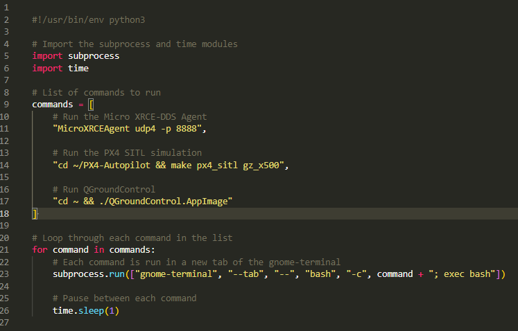

# Inter-IIT_Doc
General Docs &amp; instructions for Inter-IIT Tech Meet 13.0 (2024) High Prep PS - 1 (IdeaForge).

## PX4 Environment setup with ROS2 & Gazebo
- ROS2 humble should already be installed on your ubuntu22.04 system. If not, then install it from [here](https://docs.ros.org/en/humble/Installation/Ubuntu-Install-Debs.html).

### 1. First update the debian packages on your ubuntu :
```
sudo apt update
sudo apt upgrade -y
```

### 2. Install PX4 setup :
```
cd ~
git clone https://github.com/PX4/PX4-Autopilot.git --recursive
bash ./PX4-Autopilot/Tools/setup/ubuntu.sh
sudo reboot
```
- Please make sure that there is no error while cloning the PX4-Autopilot repository as otherwise it will cause issues in further steps.

### 3. Install ROS2 dependencies :
```
pip install --user -U empy==3.3.4 pyros-genmsg setuptools
sudo apt install python3-colcon-common-extensions
sudo apt install ros-humble-desktop python3-argcomplete
sudo apt install ros-dev-tools
```

### 4. Install XRCE-DDS Agent :
```
cd ~
git clone https://github.com/eProsima/Micro-XRCE-DDS-Agent.git
cd Micro-XRCE-DDS-Agent
mkdir build
cd build
cmake ..
make
sudo make install
sudo ldconfig /usr/local/lib/
```

### 5. Installing QGroundControl (GCS) :
```
sudo usermod -a -G dialout $USER
sudo apt-get remove modemmanager -y
sudo apt install gstreamer1.0-plugins-bad gstreamer1.0-libav gstreamer1.0-gl -y
sudo apt install libfuse2 -y
sudo apt install libxcb-xinerama0 libxkbcommon-x11-0 libxcb-cursor-dev -y
cd ~
```
- Now download the app-image file from [here](https://d176tv9ibo4jno.cloudfront.net/latest/QGroundControl.AppImage) in your `/home/username/` directory.   
- Change the executable permissions for GCS & try to run it
```
cd ~
chmod +x ./QGroundControl.AppImage
./QGroundControl.AppImage
```
Close the terminal (by interrupting with `ctrl + c`) to close the QGroundControl.

*`NOTE :`*    
- We've created 2 different ros2 workspaces for keeping our environment clean.    
- First workspace (PX4_ws) is for setting up the ros2 packages related to PX4 firmware on ubuntu 22.04.    
- Second workspace (inter-iit_ws) is where our solution for this PS is implemented.    
- Follow the upcoming steps to create both workspaces.

### 6. Creating ros2 workspace with basic packages for px4 :
```
cd ~
mkdir -p ~/PX4_ws/src/
cd ~/PX4_ws/src/
git clone https://github.com/PX4/px4_msgs.git
git clone https://github.com/PX4/px4_ros_com.git
cd ..
colcon build
echo 'source ~/PX4_ws/install/setup.bash' >> ~/.bashrc
```
- If build is failed, try building again.    
- If you encounter this setuptools error during build :

```colcon build: px4_msgs --- stderr: px4_msgs
Traceback (most recent call last): File "$HOME/ros2/ws_ros2/build/px4_msgs/ament_cmake_python/px4_msgs/setup.py", line 4, in setup
```

then try : 
```
pip list | grep packaging
```
if the version of packaging is <22.0, please upgrade it to 22.0

```
pip install packaging==22.0
```
Now try re-building the workspace.

### 7. Testing the PX4 setup :

- Build & launch the gazebo simulation with SITL
```
cd ~/PX4-Autopilot
make px4_sitl gz_x500
```   

- Run the XRCE-DDS Agent   
```
cd ~/Micro-XRCE-DDS-Agent/build
MicroXRCEAgent udp4 -p 8888
```
- Launch QGroundControl (GCS)
```
cd ~ && ./QGroundControl.AppImage
```

- In the SITL terminal (the one from where you launched gazebo), run the following command to arm & takeoff the drone
```
commander takeoff
```
- Use the command `commander land` to land the drone.


### 8. Creating the `inter-iit_ws` where the solution is implemented :

```
cd ~
mkdir -p ~/inter-iit_ws/src/
cd ~/inter-iit_ws/src/
git clone https://github.com/ab31mohit/Inter-IIT_IdeaForge-PS.git
cd ..
colcon build
echo 'source ~/inter-iit_ws/install/setup.bash' >> ~/.bashrc
```

### 9. Testing the px4 offboard control:
*Note :*    
- This package is build by [ARK-Electronics](https://github.com/ARK-Electronics) which is an extension of [Jaeyoung-Lim](https://github.com/Jaeyoung-Lim)'s work.
- This package is used in our work, just to understand how offboard control is happening with the drone.
```
cd ~/inter-iit_ws/src
git clone https://github.com/ARK-Electronics/ROS2_PX4_Offboard_Example.git
cd ..
colcon build --packages-select px4_offboard
source install/setup.bash
```
- Edit the content of `processes.py` to this
<div align="center">
  
</div>    

- Now launch the offboard setup file
```
ros2 launch px4_offboard offboard_velocity_control.launch.py
```
- Now you can try commanding the drone using the teleoperation.


### 10. Simulating motor failure : 

#### Approach: 
- PX4 SITL sends motor pwm values over the gz topic _"/x500_0/command/motor_speed"_ .
- This is read by the MulticopterMotorModel plugin of the x_500 drone in simulation. 
- We change the subscription topic of x_500 drone to a custom topic _"/x500_0/command/motor_vel"_ .
- This will be used to send custom commands to the drone. 
- We subscribe at _"/x500_0/command/motor_speed"_ topic and make changes in the pwm values and then publish at _"/x500_0/command/motor_vel"_ .

#### Implementaion:

- Install ros-gz-bridge if not installed already: 
```
sudo apt-get install ros-humble-ros-gzharmonic
```

```
cd ~/PX4-Autopilot/Tools/simulation/gz/models/x500
```

- Open the model.sdf file. For each motor plugin, change the command topic from:
```
<commandSubTopic>command/motor_speed</commandSubTopic>
```
- to 
```
<commandSubTopic>command/motor_vel</commandSubTopic>
```

- Now follow step 7 to launch and hover the drone.
- You'll notice that the drone isn't flying, because we've changed the topics. Ater that launch a new terminal and run the commands below:

```
ros2 launch px4_drone_ros_control  gz_px4_bridge.launch.py
```
- You should now see the drone is flying. 
- This re-routes PX4 msgs to our _motor_command_bypass_node_ node which can alter the pwm messages, this node subscribes an int value (motor index from 0 to 3), if received it sets the pwm value to 0 for that motor index. 
- Updated pwm values are sent to the drone. 

- To toggle the failure/working state of the _i_ th motor put the index in the command below, for example for _i_ = 0:
```
ros2 topic pub -1 /drone_control/toggle_motor_fail_state std_msgs/msg/Int16 "{data: 0}"
```

- You should see one motor stops working. 
- If you again send the same command then it toggles the motor's state and the motor will start working again. 

- *Note* : You can also use the command below to launch the QGroundControl, gz_px4_bridge.launch.py and MicroXRCEAgent all in one terminal. 
```
ros2 launch px4_drone_ros_control launch_sim_env.launch.py 
```

---

### Contributors :
[Mohit](https://github.com/ab31mohit/bandit)    
[Rajeev](https://github.com/rajeev-gupta-bashrc)    
[Ronnit](https://github.com/NULL300)      
[Abhikankshit](https://github.com/OARSS)
