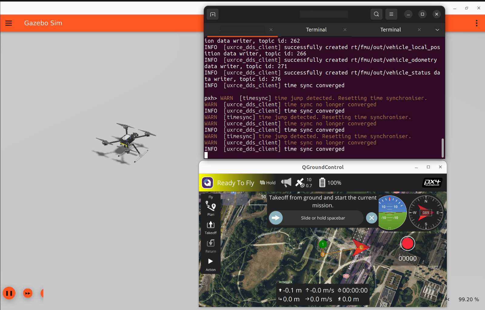
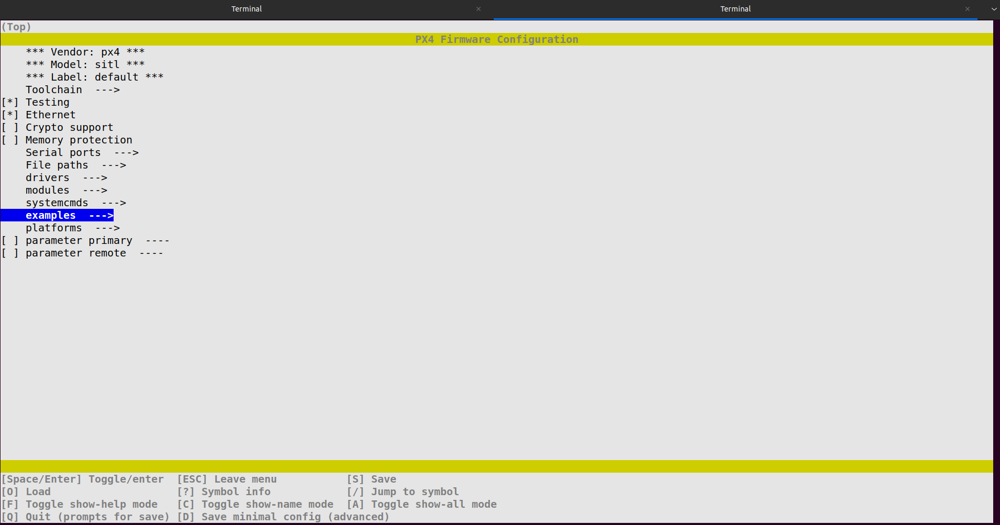
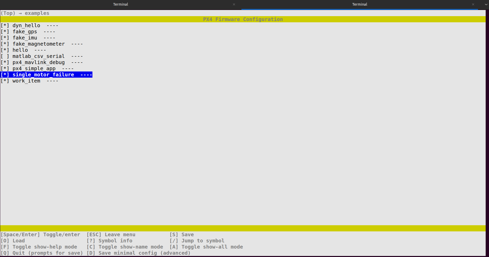
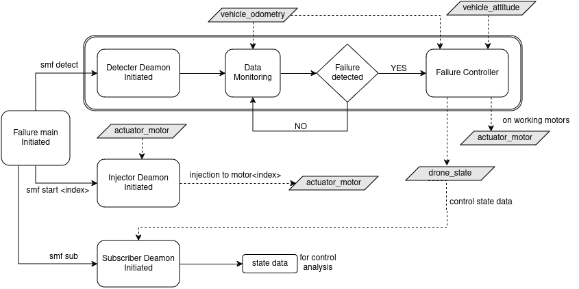

# Inter-IIT IdeaForge Doc
This is the main document for implementing the solutions for Inter-IIT IdeaForge PS.   
This document includes:
- setting up the simulation environment on your local system
- implementing motor failure through custom PX4 based module
- generating the results for real time behaviour of drone on motor failure
- running the motor failure & motor detection modules based on PX4 architecture
- Demonstration of complete motor failure, motor detection and control architecture in simulation enviroment.
The detection module will automatically trigger the control module.

## Pre-requisites :
- You system should have ubuntu-22.04 LTS Desktop installed (either dual booted with windows or completely ubuntu 22).
- In case you don't have ubuntu-22.04 dual boot, you can follow this tutorial [dual boot ubuntu-22.04](https://www.youtube.com/watch?v=QKn5U2esuRk).


## PX4 Environment setup with ROS2 & Gazebo

### 1. First update the debian packages on your system :  
- Run these commands in your terminal
```
sudo apt update
sudo apt upgrade -y
```

### 2. Install ROS2-humble :
- Follow this tutorial -> [install ros2-humble](https://docs.ros.org/en/humble/Installation/Ubuntu-Install-Debs.html).

- Run this command to permanantly source your ros2 environment
```
echo "source /opt/ros/humble/setup.bash" >> ~/.bashrc
```

### 3. Install PX4 firmware :
```
cd ~
git clone https://github.com/PX4/PX4-Autopilot.git --recursive
bash ./PX4-Autopilot/Tools/setup/ubuntu.sh
sudo reboot
```
- Please make sure that there is no error while cloning the PX4-Autopilot repository as otherwise it will cause issues in further steps.

### 4. Install ROS2 dependencies :
```
pip install --user -U empy==3.3.4 pyros-genmsg setuptools
sudo apt install python3-colcon-common-extensions
sudo apt install ros-humble-desktop python3-argcomplete
sudo apt install ros-dev-tools
```

### 5. Install XRCE-DDS Agent :
Installing XRCE-DDS Agent for accessing uORB topics from ROS2 topics.
```
cd ~
git clone https://github.com/eProsima/Micro-XRCE-DDS-Agent.git
cd Micro-XRCE-DDS-Agent
mkdir build
cd build
cmake ..
make
sudo make install
sudo ldconfig /usr/local/lib/
```
Note: **<span style="color:orange">smf sub</span>** and **<span style="color:orange">odometry_subscriber.py</span>** requires DDS Agent running.

### 6. Installing QGroundControl (GCS) :
```
sudo usermod -a -G dialout $USER
sudo apt-get remove modemmanager -y
sudo apt install gstreamer1.0-plugins-bad gstreamer1.0-libav gstreamer1.0-gl -y
sudo apt install libfuse2 -y
sudo apt install libxcb-xinerama0 libxkbcommon-x11-0 libxcb-cursor-dev -y
cd ~
```
- Now download the app-image file from [here](https://d176tv9ibo4jno.cloudfront.net/latest/QGroundControl.AppImage) in your **<span style="color:orange">/home/username/</span>** directory.   
- Change the executable permissions for GCS & try to run it
```
cd ~
chmod +x ./QGroundControl.AppImage
./QGroundControl.AppImage
```
Close the terminal (by interrupting with **<span style="color:orange">ctrl + c</span>**) to close the QGroundControl.


### 7. Testing the PX4 setup :

- Build & launch the gazebo simulation with SITL
```
cd ~/PX4-Autopilot
make px4_sitl gz_x500
```   

- Run the XRCE-DDS Agent   
```
cd ~/Micro-XRCE-DDS-Agent/build
MicroXRCEAgent udp4 -p 8888
```
- Launch QGroundControl (GCS)
```
cd ~ && ./QGroundControl.AppImage
```

- In the SITL terminal (the one from where you launched gazebo), run the following command to arm & takeoff the drone
```
commander takeoff
```
If everything works fine, you should get something like this
<div align="center">
  
</div> 

- Use the command **<span style="color:orange">commander land</span>** to land the drone.

### 8. Creating Workspace 
Clone the repositry in Home directory
```
git clone interIIT_64 bkchdi bkchdi
```
File Structure: 
```
inter-iit_Team62  
├── Flight_Analysis                      # Contains all flight analysis data and scripts  
│   ├── detection_logs                   # vehicle_odometry data for detection purpose
│   │   ├── csv                          # Odometry CSV files
│   │   │   └── odometry_data_0.csv         
│   │   ├── plots                        # Odometry plots  
│   │   │   └── odometry_plot_0.png          
│   │   └── px4_logs                     # px4 detection logs  
│   │       └── px4_logs_0.csv
|   |           
│   ├── flight_logs                      # Flight state logs from drone_state.h  
│   │   └── flight_log_0.csv
|   |            # Flight log details  
│   ├── scripts                  
│   │   ├── automation                   # Scripts for automated drone tasks  
│   │   │   ├── demo.sh                  # Script for demonstrating smf functionality  
│   │   │   ├── hovering.sh              # Script for automating drone hovering sessions  
│   │   │   ├── takeoff.sh               # Script for automating drone takeoff sessions
│   │   │   └── manuevring.sh            # Script for automating drone maneuvers sessions 
│   │   ├── launch_drone_env.py          # launched drone env (QGC + DDS Agent)  
│   │   ├── mission.py                   # Script for running a MAVSDK mission  
│   │   ├── odometry_subscriber.py       # Script for subscribing to odometry data  
│   │   └── plotting_automation.py       # Script for automating data plotting  
|   |
│   ├── LQR_Optimizer.ipynb              # Notebook to optimize LQR and tuning penalty and control matrices.  
│   └── px4_data_plotter.ipynb           # Notebook for plotting flight_logs data 
|  
└── px4_modules
    ├── gazebo_classic_fault_tolerant_control  #Classic fault tolerant control module
    ├── iris_with_standoffs              # IRIS quadcopter meshes
    ├── single_motor_failure             # smf module 
    ├── DroneState.msg                   # custom uORB message
    ├── model.sdf                        # iris sdf file for harmonic
     
```
### 9. Importing Iris quadcopter into Gazebo Harmionic :
- To ensure consistent physical parameters for the drone in both Classic and Harmonic simulations, we decided to import the Iris quadcopter functionalities into the Harmonic environment as well.
- Further we have also doubled thre motor constant parameter in the drone to increase the thrust range of all motors.
- Follow the following setup instructions for the migration of iris.
  

- Go to **<span style="color:orange">~/PX4-Autopilot/Tools/simulation/gz/models/x500/</span>** directory and replace the ***model.sdf***  file to the this file: [model.sdf](px4_modules/model.sdf).
- Further add meshes files in: **<span style="color:orange">~/PX4-Autopilot/Tools/simulation/gz/models/</span>** directory and paste the complete [iris_with_standoffs](px4_modules/iris_with_standoffs) folder there.
### 10. Adding Custom uORB message **<span style="color:orange">drone_state.msg</span>**
- In order to analyze data from controller we have added a custom uORB message. Follow the steps to add the custom uORB message in PX4 firmware.
- Paste the [DroneState.msg](px4_modules/DroneState.msg) into **<span style="color:orange">~/PX4-Autopilot/msg/</span>** directory.
- Locate the CMakeLists.txt in **<span style="color:orange">~/PX4-Autopilot/msg/</span>** and add the **<span style="color:orange">DroneState.msg</span>**

### 11. Updating CMAKE_CXX_STANDARD Version.
- Follow the following steps to upgrade the CMAKE_CXX_STANDARD to 17.
- Locate the **<span style="color:orange">~/PX4-Autopilot/CMakeLists.txt/</span>** file and change the CMAKE_CXX_STANDARD version
```
set(CMAKE_CXX_STANDARD 17)
set(CMAKE_CXX_STANDARD_REQUIRED ON)
set(CMAKE_C_STANDARD 11)
set(CMAKE_C_STANDARD_REQUIRED ON)
set(CMAKE_EXPORT_COMPILE_COMMANDS ON)
```
Make sure to match the above block in the CMakeLists.txt.
#### Installing Filesystem
-Install [filesystem](https://docs.pyfilesystem.org/en/latest/introduction.html) for data collection from SMF Module. 
```
pip install filesystem
```
## Building custom px4 module
- For simulating single motor failure, we have created a custom module based on PX4 firmware architecture named [single_motor_failure](px4_modules/single_motor_failure/).
- In this module we've integrated injection of single motor failure, detection of motor failure and controlling the drone after detection of motor failure.
- We have used the predefined px4 based UORB topics to send commands to the drone in the modules.
- You can follow [creating custom px4 module](px4_modules/modules_README.md) doc to know more about how to create a custom px4 module and compile it. 

### 1. Building the module in PX4-firmware:
In order to run the **<span style="color:orange">single_motor_failure</span>** module you first need to make sure that it is built as part of PX4 Firmware.    
Applications are added to the build/firmware in the appropriate board-level px4board file for your target:

PX4-SITL (Simulator) : px4_sitl_default

- To use this module, copy the [single_motor_failure](px4_modules/single_motor_failure/) directory to **<span style="color:orange">~/PX4-Autopilot/src/examples/</span>** directory.
 Further run boardconfig command and add smf module to PX4 sitl firmware and build afterwards.

```
cd ~/PX4-Autopilot/
make px4_sitl_default boardconfig
```

<div style="display: flex; justify-content: space-between;">
  
  
</div>


- Go to examples, you will file a new module named **<span style="color:orange">single_motor_failure</span>**, select that & press enter. Now save this module by pressing **<span style="color:orange">Q</span>** & then select **<span style="color:orange">yes</span>**. 

- Now this module is ready to run as part of PX4 firmware in sitl. Run the following command to build the module in PX4 firmware.
```
cd ~/PX4-Autopilot/
make px4_sitl
```

**<span style="color:black">*NOTE:*</span>**   
For other boards, please select the specific board in the compiltion step.

## **<span style="color:orange">single_motor_failure</span>** module Demonstration

### 1. Overview:
<div align="center">
  
</div> 

### 2.Detector Deamon
```
cd ~/PX4-Autopilot
make px4_sitl gz_x500
```
- Run XRCE-DDS agent to convert px4 uorb topics to ros2 topics
```
cd ~/Micro-XRCE-DDS-Agent/build
MicroXRCEAgent udp4 -p 8888
```
- Launch QGroundControl (GCS)
```
cd ~ && ./QGroundControl.AppImage
```
- Takeoff your drone to default height (2.5m) by typing this command in your px4 sitl terminal
```
commander takeoff
```
Note: Use **<span style="color:orange">param set MIS_TAKEOFF_ALT <$Height></span>** to change the default height of takeoff.

- Run the detection file of the module to initiate **<span style="color:orange">Detector Deamon</span>** which will be keep checking for motor failure (if there is any).
```
smf detect
```
- This will store a csv log file in **<span style="color:orange">inter-iit_Team62/detection_tests/detection_logs/px4_logs</span>** as **px4_logs_0.csv**.
### 3. Odom and State data Subscribing (optional)
-  Run the following command in new terminal to start collecting odometry data from **vehicle_odometry** ROS@ topic and will store **odometry_data_0.csv** in **<span style="color:orange">inter-iit_Team62/detection_tests/detection_logs/csv</span>**
```
python3 inter-iit_Team62/detection_tests/scripts/odometry_subscriber.py
```
- Initiate subscribing deamon using **smf sub** in SITL shell to start subscribing state data from **drone_state.h** uORB topic and log them in **<span style="color:orange">inter-iit_Team62/detection_tests/detection_logs/state_logs</span>**
```
smf sub
```
### 3. injecting the motor failure:
Before running this command, make sure everything in step 2 is already working.

- run this command in px4 sitl terminal to fail a motor in gazebo simulation
```
smf start
```
This will initiate the **<span style="color:orange">Injector Deamon</span>** and will inject motor failure.

### 5. Motor Failure Control 
- After injecting motor failure, **<span style="color:orange"> Detector Deamon** should detect the failure and trigger a detection flag which will eventually activates **Failure Controller**. 
- It will publish state logs to **drone_state**, which will be subscribed by **subscriber deamon** (if initiated).

### 6. Analysing Collected data and logs
#### (i) Odom Plots:
- This requires px4_logs_0.csv and odometry_data_0.csv to plot data for a flight.
```
python3 inter-iit_Team62/detection_tests/scripts/plotting_automation.py 
```
- This will store plots for all the odometry_data and px4_logs pairs in **<span style="color:orange">inter-iit_Team62/detection_tests/detection_logs/plots</span>**
- It will also store a **result.csv** in **<span style="color:orange">inter-iit_Team62/detection_tests/detection_logs</span>**, which will contain the performance metrics of tests for the available number of data sessions.
#### (ii) State Plots:
- Refer to [px4_data_plotter.ipynb](Flight_Analysis/px4_data_plotter.ipynb). Update the path of **flight_log** in the first cell and run the remaining cells to plot the state data.

## Automation Script Demonstration
### 1. Install tmux
- Install tmux, which is required for automated bash scripts.
```
sudo apt update
sudo apt install tmux
```

### 2. Running demo.sh
- Launch drone enviroment i.e. (DDS Agent and QGroundControl)
```
python3 inter-iit_Team62/Flight_Analysis/scripts/launch_drone_env.py 
```
- Run the [demo.sh](Flight_Analysis/scripts/automation/demo.sh) in a terminal using following command
```
bash inter-iit_Team62/detection_tests/scripts/automation/demo.sh
```
- This bash file uses tmux to run different sessions of gazebo & px4 sitl.
- This will launch a complete session for demonstration of motor_failure and will save the required logs in respective directories. Refer to [6](#6-analysing-collected-data-and-logs) for plotting collected data. 
