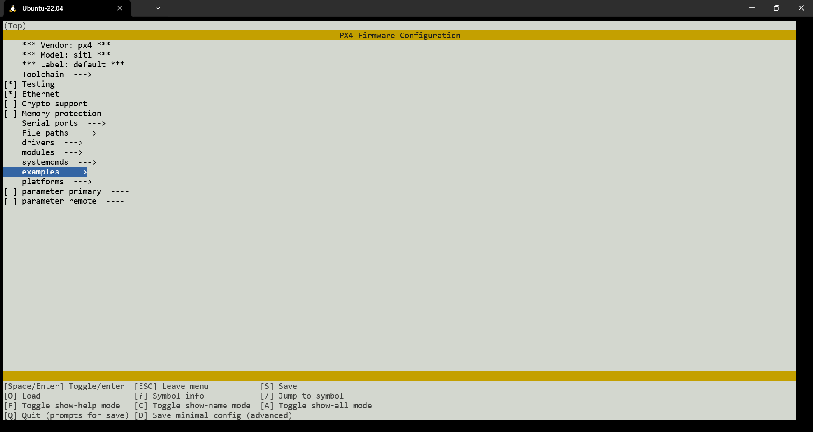
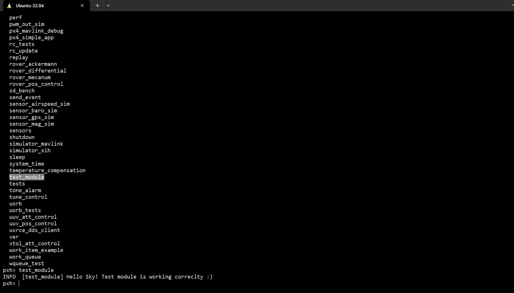

# Creating your custom px4 module
This guide helps you to create your own custom module that can be well integrated with PX4 firmware. For more information about creating your custom module please visit [Creating your own px4-module](https://github.com/PX4/PX4-user_guide/blob/main/tr/modules/hello_sky.md).

## Creating minimal module application
In this section we create a minimal application that just prints out Hello Sky!. This consists of a single C file and a cmake definition (which tells the toolchain how to build the application)

### 1. Creating module named `test_module`:
```
cd ~/PX4-Autopilot/src/examples/
mkdir test_module
cd test_module
```

### 2. Create a new C file named `test_module.c` & add following code in it:

- Copy in the default header to the top of the page. This should be present in all contributed files
```
/****************************************************************************
 *
 *   Copyright (C) 2024 Inter-IIT Team 62. All rights reserved.
 *
 * Redistribution and use in source and binary forms, with or without
 * modification, are permitted provided that the following conditions are met:
 *
 * 1. Redistributions of source code must retain the above copyright
 *    notice, this list of conditions and the following disclaimer.
 * 2. Redistributions in binary form must reproduce the above copyright
 *    notice, this list of conditions and the following disclaimer in the
 *    documentation and/or other materials provided with the distribution.
 * 3. Neither the name PX4 nor the names of its contributors may be used
 *    to endorse or promote products derived from this software without
 *    specific prior written permission.
 *
 * THIS SOFTWARE IS PROVIDED BY THE COPYRIGHT HOLDERS AND CONTRIBUTORS
 * "AS IS" AND ANY EXPRESS OR IMPLIED WARRANTIES, INCLUDING, BUT NOT
 * LIMITED TO, THE IMPLIED WARRANTIES OF MERCHANTABILITY AND FITNESS FOR
 * A PARTICULAR PURPOSE ARE DISCLAIMED. IN NO EVENT SHALL THE COPYRIGHT
 * OWNER OR CONTRIBUTORS BE LIABLE FOR ANY DIRECT, INDIRECT, INCIDENTAL,
 * SPECIAL, EXEMPLARY, OR CONSEQUENTIAL DAMAGES (INCLUDING, BUT NOT
 * LIMITED TO, PROCUREMENT OF SUBSTITUTE GOODS OR SERVICES; LOSS OF USE,
 * DATA, OR PROFITS; OR BUSINESS INTERRUPTION) HOWEVER CAUSED AND ON ANY
 * THEORY OF LIABILITY, WHETHER IN CONTRACT, STRICT LIABILITY, OR TORT
 * (INCLUDING NEGLIGENCE OR OTHERWISE) ARISING IN ANY WAY OUT OF THE USE OF
 * THIS SOFTWARE, EVEN IF ADVISED OF THE POSSIBILITY OF SUCH DAMAGE.
 *
 ****************************************************************************/

/**
 * @file failure_controller.h
 *  Header of Controller class
 *
 */

#include <px4_platform_common/log.h>

__EXPORT int test_module_main(int argc, char *argv[]);

int test_module_main(int argc, char *argv[])
{
   PX4_INFO("Hello Sky! Test module is working correclty :)");
   return OK;
}
```
*`NOTE:`*
- The main function must be named `<module_name>_main` and exported from the module as shown above.
- `PX4_INFO` is the equivalent of printf for the PX4 shell (included from px4_platform_common/log.h). There are different log levels: `PX4_INFO`, `PX4_WARN`, `PX4_ERR`, `PX4_DEBUG`.

### 3. Creating `CMakeLists.txt` file in the test_module & copy the following code in it:
```
############################################################################
#
#   Copyright (c) 2024 Inter-IIT Team 62. All rights reserved.
#
# Redistribution and use in source and binary forms, with or without
# modification, are permitted provided that the following conditions
# are met:
#
# 1. Redistributions of source code must retain the above copyright
#    notice, this list of conditions and the following disclaimer.
# 2. Redistributions in binary form must reproduce the above copyright
#    notice, this list of conditions and the following disclaimer in
#    the documentation and/or other materials provided with the
#    distribution.
# 3. Neither the name PX4 nor the names of its contributors may be
#    used to endorse or promote products derived from this software
#    without specific prior written permission.
#
# THIS SOFTWARE IS PROVIDED BY THE COPYRIGHT HOLDERS AND CONTRIBUTORS
# "AS IS" AND ANY EXPRESS OR IMPLIED WARRANTIES, INCLUDING, BUT NOT
# LIMITED TO, THE IMPLIED WARRANTIES OF MERCHANTABILITY AND FITNESS
# FOR A PARTICULAR PURPOSE ARE DISCLAIMED. IN NO EVENT SHALL THE
# COPYRIGHT OWNER OR CONTRIBUTORS BE LIABLE FOR ANY DIRECT, INDIRECT,
# INCIDENTAL, SPECIAL, EXEMPLARY, OR CONSEQUENTIAL DAMAGES (INCLUDING,
# BUT NOT LIMITED TO, PROCUREMENT OF SUBSTITUTE GOODS OR SERVICES; LOSS
# OF USE, DATA, OR PROFITS; OR BUSINESS INTERRUPTION) HOWEVER CAUSED
# AND ON ANY THEORY OF LIABILITY, WHETHER IN CONTRACT, STRICT
# LIABILITY, OR TORT (INCLUDING NEGLIGENCE OR OTHERWISE) ARISING IN
# ANY WAY OUT OF THE USE OF THIS SOFTWARE, EVEN IF ADVISED OF THE
# POSSIBILITY OF SUCH DAMAGE.
#
############################################################################
px4_add_module(
 MODULE examples__test_module
 MAIN test_module
 STACK_MAIN 2000
 SRCS
     test_module.c
 DEPENDS
 )
```
- The px4_add_module() method builds a static library from a module description.
- The MODULE block is the Firmware-unique name of the module (by convention the module name is prefixed by parent directories back to src).
- The MAIN block lists the entry point of the module, which registers the command with NuttX so that it can be called from the PX4 shell or SITL console

### 4. Create a `Kconfig` definition file in the test_module & copy the following code in it:
```
menuconfig EXAMPLES_TEST_MODULE
 bool "test_module"
 default n
 ---help---
     Enable support for test_module
```

### 5. Building the module in PX4-firmware:
The application/module is now complete. In order to run it you first need to make sure that it is built as part of PX4. Applications are added to the build/firmware in the appropriate board-level px4board file for your target:

PX4-SITL (Simulator) : px4_sitl_default

- To enable the compilation of the application/module into the firmware add the corresponding Kconfig key CONFIG_EXAMPLES_TEST_MODULE=y in the `px4board` file or run boardcofonfig make command a follows
```
cd ~/PX4-Autopilot/
make px4_sitl_default boardconfig
```
It will open a new window like this
<div align="center">
  
</div>

Go to examples, you will file a new module named `test_module`, select that & press enter. Now save this module by pressing `Q` & then select `yes`.

### Testing the module:
- Launch the sitl (for gazebo classic)
```
cd ~/PX4-Autopilot/
make px4_sitl gazebo-classic
```
Or for gazebo harmonic use this instead
```
cd ~/PX4-Autopilot/
make px4_sitl gz_x500
```
- In the sitl type `help` & you will see your `test_module` is now part of PX4-SITL board.
You can type `test_module` to see if your moule is working correctly.

<div align="center">
  
</div>

## Using modules defined in 'px4_modules'
This `px4_modules` directory containes necessary px4 modules for this Problem statement like

### 1. single_motor_failure (smf)
This `smf` or single_motor_failure module will do all the work from failing a specific motor to detecting which motor has failed & stabilizing the drone afterwards.

#### Usage:
- Run the motor failure detection sub-module as soon as you start your drone
```
smf detect
```
- Fail any particular motor (1....12) using
```
smf start 2
```
to fail 2nd motor (motor_id 1)
- To stop injecting motor failure use (might not work)
```
smf stop
```
- To see the status of `smf` command use
```
smf status
```
